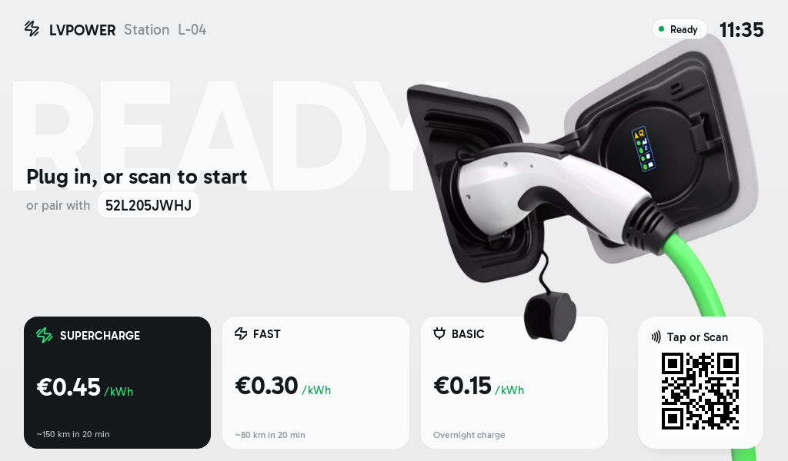
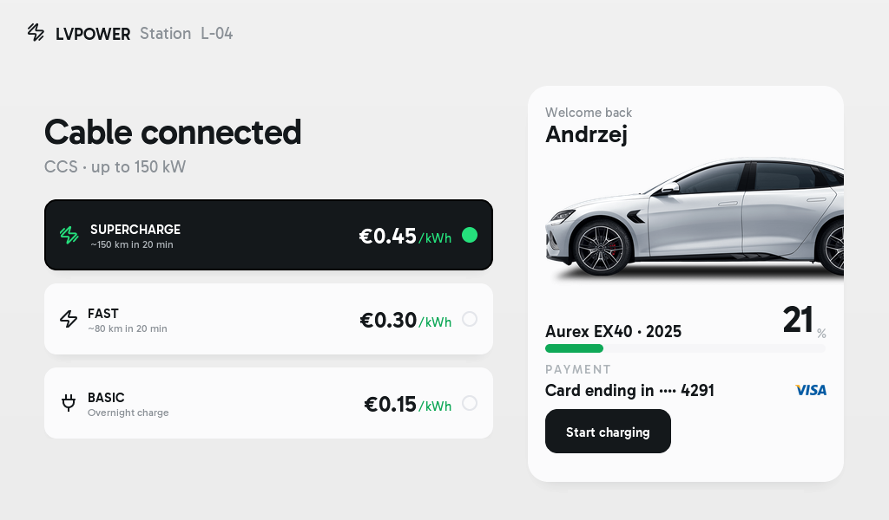
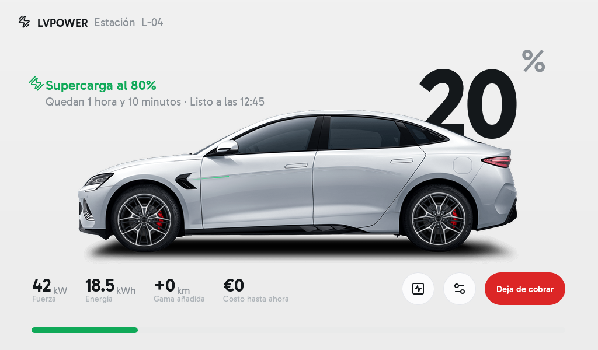
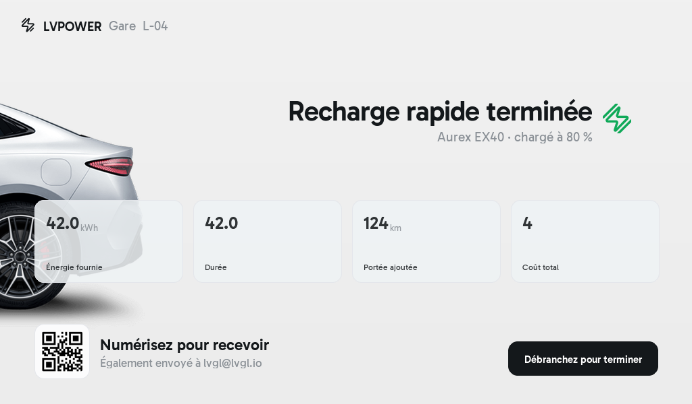

# LVPOWER

LVPOWER is an LVGL Pro electric vehicle charger HMI demo for a 1024 x 600 display.

The project was initially generated from Figma using the Figma Flow plugin.
It has since been modified to add animations & translations.

## Try it Online

You can preview and interact with the UI directly in your browser via the LVGL online viewer:

https://viewer.lvgl.io/?repo=https://github.com/lvgl-pro-projects/figma--lvpower-1024x600

Or a live view:

https://htmlpreview.github.io/?https://github.com/lvgl-pro-projects/figma--lvpower-1024x600/blob/main/preview-bin/web/index.html

## Screenshots

| Idle                                 | Member auth                          |
| ------------------------------------ | ------------------------------------ |
|  |  |

| Charging                                     | Complete                                           |
| -------------------------------------------- | -------------------------------------------------- |
|  |  |

See `sim/README.md` for simulator-specific notes.
